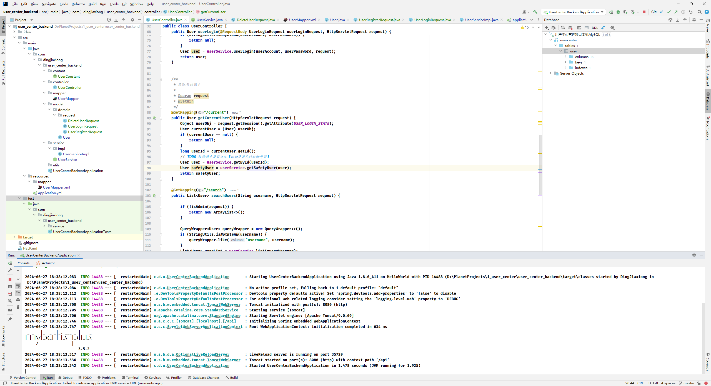
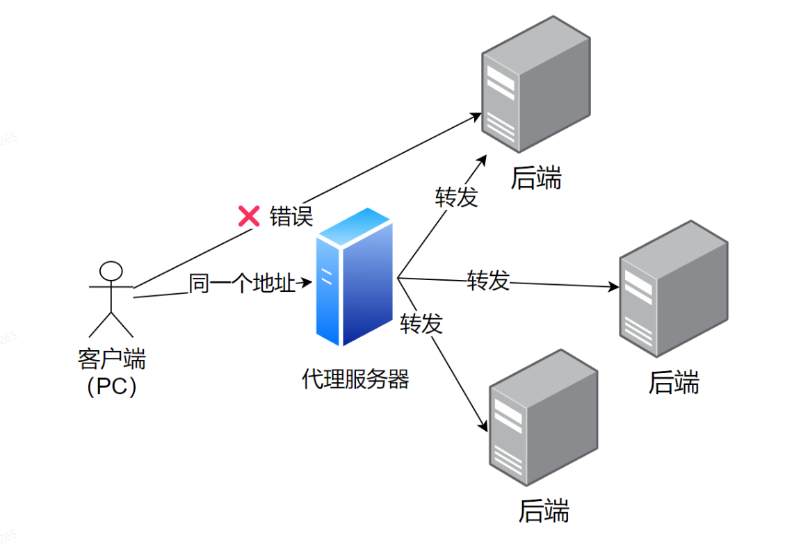
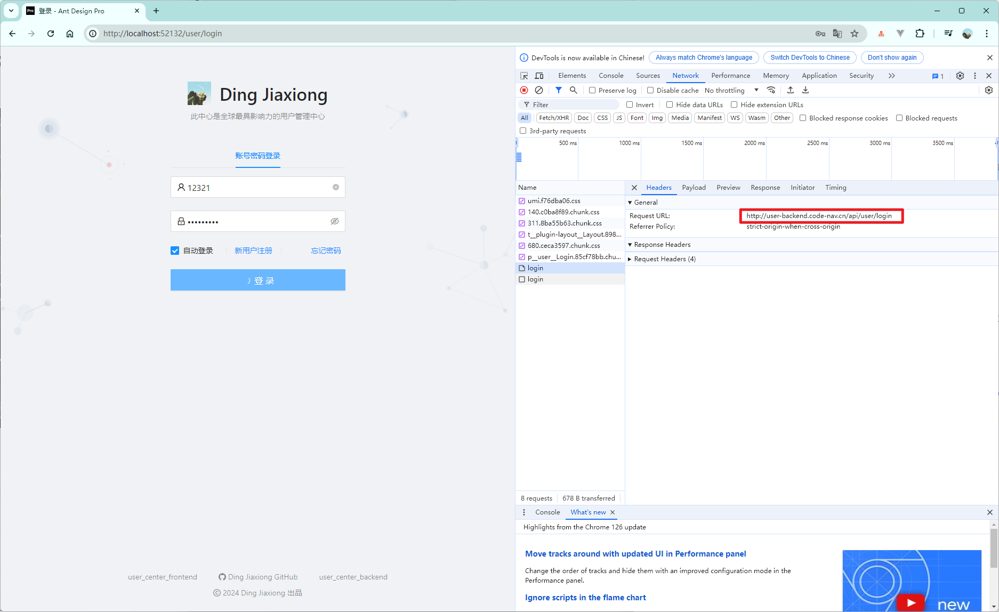

## 伙伴匹配系统

#### 1. 项目简介


企业核心的伙伴匹配项目，基于 Spring Boot 后端 + Vue 前端的 **全栈项目** ，实现了用户注册、登录、查询，用户可以匹配自己志同道合的小伙伴，也可以加入队伍等基础功能。


##### 1.1 项目收获


1. 学会前后端企业主流开发技术的应用
2. 了解做项目的完整流程，能够独立开发及上线项目
3. 学到系统设计的方法和经验
4. 学到一些实际的编码技巧，比如开发工具、快捷键、插件的使用
5. 学到代码的优化技巧，比如抽象、封装、提高系统性能、节约资源的方法
6. 学习登录态、代理、多环境、容器、跨域等重要的开发知识
7. 学到一些源码阅读的技巧
8. 提升自主解决问题的能力


##### 1.2 技术选型


###### 前端


主要运用阿里Ant Design生态：

- HTML+CSS+JavaScript三件套
- React开发框架
- Ant Design Pro项目模板
- Ant Design端组件库
- Umi开发框架
- Umi Request请求库
- 正向和反向代理


###### 后端


- Java编程语言
- Spring+SpringMVC+SpringBoot框架
- MyBatis+MyBatis Plus数据访问框架
- MySQL数据库
- jUnit单元测试库
- redis缓存，通过Redisson实现分布式锁


###### 部署


- Linux单机部署
- Nginx Web服务器
- Docker容器
- 容器托管平台


#### 2. 项目开发流程


##### 2.1 需求分析


1. 登录/注册
2. 用户管理（仅管理员可见）对用户的查询或者修改
3. 用户校验（仅星球用户可见）
4. 用户通过标签查询好友
5. 用户加入感兴趣的队伍


##### 2.2 技术选型


- 前端

  三件套+Vue+组件库vant Design+Umi+Ant Design Pro(现成的管理系统)

- 后端

    - java
    - spring(依赖注入框架，帮助你管理Java对象，集成一些其他的内容)
    - springmvc(web框架，提供接口访问、restful接口等能力)
    - mybatis(Java操作数据库的框架，持久层框架，对jdbc的封装)
    - mybatis-plus(对mybatis的增强，不用写sql也实现增删改查
    - springboot(快速启动/快速集成项目。不用自己管理spring配置，不用自己整合各种框架)
    - junit单元测试库
    - mysql数据库
    - redis作为缓存使用

- 部署

  服务器/容器（平台）


##### 2.3 初始化项目


###### 2.3.1 前端初始化


技术版本：

- Node：`16.20.2`
- Ant Design Pro
- Yarn：`1.22.22`
- @ant-design/pro-cli：`3.1.0`  【`npm i @ant-design/pro-cli@3.1.0 -g`】


初始化命令：`pro create user_center_frontend`，用`umi 3`，简单脚手架


`npm install` 一下，安装依赖【这里直接用 `yarn` 好像也会有问题，版本】


好了，加入`umi-ui`：`yarn add @umijs/preset-ui -D`


版本有问题，用`npm add @umijs/preset-ui -D`


添加一个分析页


报错了


其实是淘宝镜像源过期了，控制台已经报错了


但其实我本地已经换过了，把yarn 的也换了还是不行，罢了，不能头铁，毕竟保质期，这个页面我们根本用不到

【其实问题已经发现了】


**项目瘦身**


删删删


取消国际化：


删了一些东西


###### 2.3.2 后端初始化


**数据库**

MySQL安装：


不装了


IDEA 直接启动项目，用阿里云的模板


勾依赖


就这样，直接创建


构建完成，连接数据库


框架整合


**引入MP**


```xml
<!--    mybatis-plus    -->
<dependency>
    <groupId>com.baomidou</groupId>
    <artifactId>mybatis-plus-boot-starter</artifactId>
    <version>3.5.2</version>
</dependency>
```


**单元测试**


```xml
<!--    junit 单元测试    -->
<dependency>
    <groupId>junit</groupId>
    <artifactId>junit</artifactId>
    <version>4.13.2</version>
    <scope>test</scope>
</dependency>
```


##### 2.4 数据库表设计


###### 2.4.1 用户表设计


- id (主键) bigint
- username 昵称 varchar
- userAccount 登录账号
- avatarUrl 头像 varchar
- gender 性别 tinyint
- userPassword 密码 varchar
- phone 电话 varchar
- email 邮箱 varchar
- userStatus 用户状态 int 0-正常
- createTime 创建时间（数据插入时间）datetime
- updateTime 更新时间（数据更新时间）datetime
- isDelete是否删除 0 1（逻辑删除）tinyint
- userRole 用户角色 0-普通用户 1-管理员


`SQL`脚本：


```sql
# 用户表
create table user
(
    username     varchar(256)                       null comment '用户昵称',
    id           bigint auto_increment comment 'id'
        primary key,
    userAccount  varchar(256)                       null comment '账号',
    avatarUrl    varchar(1024)                      null comment '用户头像',
    gender       tinyint                            null comment '性别',
    userPassword varchar(512)                       not null comment '密码',
    phone        varchar(128)                       null comment '电话',
    email        varchar(512)                       null comment '邮箱',
    userStatus   int      default 0                 not null comment '状态 0 - 正常',
    createTime   datetime default CURRENT_TIMESTAMP null comment '创建时间',
    updateTime   datetime default CURRENT_TIMESTAMP null on update CURRENT_TIMESTAMP,
    isDelete     tinyint  default 0                 not null comment '是否删除'
)
    comment '用户';
```


创建


##### 2.5 注册功能


代码生成器：`Mybatis-X`


测试插入

```java
package com.dingjiaxiong.user_center_backend.service;

import com.dingjiaxiong.user_center_backend.model.User;
import com.hrc.friendMatch.service.UserService;
import org.junit.jupiter.api.Assertions;
import org.junit.jupiter.api.Test;
import org.springframework.boot.test.context.SpringBootTest;

import javax.annotation.Resource;

@SpringBootTest
public class UserServiceTest {

    @Resource
    private UserService userService;

    @Test
    public void testAddUser() {

        User user = new User();
        user.setUsername("dogDingJiaxiong");
        user.setUserAccount("123");
        user.setAvatarUrl("https://pics0.baidu.com/feed/5fdf8db1cb13495437cd2b54e0f12454d0094a7f.jpeg?token=958bb5f910b4e78dc9d5995fb46847d5");
        user.setGender(0);
        user.setUserPassword("xxx");
        user.setPhone("123");
        user.setEmail("456");

        boolean result = userService.save(user);

        System.out.println(user.getId());
        Assertions.assertTrue(result); // 希望返回true

    }

}
```


**注册逻辑**


1. 用户在前端输入账户和密码、以及校验码(todo)】
2. 校验用户的账户、密码、校验密码，是否符合要求
   a. 非空
   b. 账户长度不小于4位
   c. 密码就不小于8位吧
   d. 账户不能重复
   e. 账户不包含特殊字符
   f. 密码和校验密码相同
3. 对密码进行加密（密码千万**不要直接以明文**存储到数据库中）
4. 向数据库插入用户数据


`coding`：


好用的校验类库：


```xml
<!--    校验类库    -->
<dependency>
    <groupId>org.apache.commons</groupId>
    <artifactId>commons-lang3</artifactId>
    <version>3.12.0</version>
</dependency>
```


**前端 - 快速页面开发**


注册也调通


##### 2.6 登录功能


###### 2.6.1 接口设计


接受参数：用户账户、密码

请求类型：`POST`

请求体：`JSON` 格式的数据

返回值：用户信息（脱敏）


###### 2.6.2 登录逻辑


1. 校验用户账户和密码是否合法
   a. 非空
   b. 账户长度不小于4位
   c. 密码就不小于8位
   d. 账户不包含特殊字符
2. 校验密码是否输入正确，要和数据库中的密文密码去对比
3. 用户信息脱敏，隐藏敏感信息，防止数据库中的字段泄露
4. 我们要记录用户的登录态(session)，将其存到明服务器上（用后端SpringBoot框架封装的服务器tomcat去记录)】
5. 返回脱敏后的用户信息


**如何知道是哪个用户登录了？**


1. 连接服务器端后，得到一个session状态（匿名会话），返回给前端
2. 登录成功后，得到了登录成功的session,并且给该session设置一些值（比如用户信息），返回给前端一个设置cookie的”命令“
   session => cookie
3. 前端接收到后端的命令后，设置cookie,保存到浏览器内
4. 前端再次请求后端的时候（相同的域名），在请求头中带上cookie去请求
5. 后端拿到前端传来的cookie,找到对应的session
6. 后端从session中可以取出基于该session存储的变量（用户的登录信息、登录名）


###### 2.6.3 接口开发及测试


**校验写在哪里**？

- controller层倾向于对请求参数本身的校验，不涉及业务逻辑本身（越少越好）
- service层是对业务逻辑的校验（有可能被controller之外的类调用）


简单测试：


注册：


登录：


OK， 之前就是做到这里了。


**登录态管理**


获取当前登录用户接口：





登录完成，水印、头像、用户名都搞上去了【到这里就还差一个注销功能】


##### 2.7 代理


正向代理：替客户端向服务器发送请求，可以解决跨域问题


反向代理：替服务器统一接收请求。





怎么实现代理？

- Nginx服务器
- Node.js服务器


##### 2.8 用户管理功能


管理接口：

1. 查询用户（允许根据用户名查询）
2. 删除用户


【注意，必须鉴权】加入角色属性


###### 2.8.1 后端开发


查询和删除


删除接口改了一下，之前那个不能直接用


###### 2.8.2 前端页面开发


不用mock，自己写了


一顿操作后，决定使用代理来解决跨域问题


原本请求：http://localhost:8000/api/user/login

代理请求到：http://localhost:8080/api/user/login


###### 2.8.3 前后端联调


发起登录请求


没问题


`ProComponents` 高级表单


##### 2.9 用户注销功能


###### 2.9.1 后端开发


###### 2.9.2 前端开发


##### 2.10 后端代码优化


###### 2.10.1 用户校验


注册的时候加一层【用户可信自觉校验】


2 - 5 位的编号。


###### 2.10.2 用户体验优化


前端加上星球编号展示以及注册


###### 2.10.3 通用反馈对象


目的：给对象补充一些信息，告诉前端这个请求在业务层面上是成功还是失败


和一个工具类


修改之前的接口返回信息，


所有接口同理


###### 2.10.4 自定义异常及错误码


替换之前返回的错误，


这样写还是不优雅，祭出全局异常处理器


###### 2.10.5 全局异常处理器


自定义异常类


改掉之前的异常


全局处理类


捕获代码中所有的异常，内部消化，集中处理，让前端得到更详细的业务报错 / 信息。


##### 2.11 前端优化


**全局请求响应拦截器封装**


1. 对接后端的返回值，直接取出data
2. 全局响应处理


##### 2.12 项目部署


###### 2.12.1 多环境理论


鱼皮哥的文章：https://blog.csdn.net/weixin_41701290/article/details/120173283


多环境：指同一套项目代码在不同的阶段需要根据实际情况来调整配置并且部署到不同的机器上。


为什么需要多环境？

1. 每个环境互不影响
2. 区分不同的阶段：开发/测试/生产
3. 对项目进行优化：
    - 本地日志级别
    - 精简依赖，节省项目体积
    - 项目的环境/参数可以调整，比如 `JVM` 参数


针对不同环境故不同的事情。


多环境分类：

1. 本地环境（自己的电脑）localhost
2. 开发环境（远程开发）大家连同一台机器，为了大家开发方便
3. 测试环境（测试）开发/测试/产品，单元测试/性能测试/功能测试/系统集成测试，独立的数据库、独立的服务器
4. 预发布环境（体验服）：和正式环境一致，正式数据库，更严谨，查出更多问题
5. 正式环境（线上，公开对外访问的项目）：尽量不要改动，保证上线前的代码是“完美”运行
6. 沙箱环境（实验环境）：为了做实验


###### 2.12.2 前端多环境实战


用了`umi`框架，`build`时会自动传入`NODE_ENV==production`参数，`start` `NODE_ENV`参数为`development`





> serve 工具，本地直接启动前端打包好的项目


不同的项目（框架）都有不同的配置文件，umi的配置文件是config ,可以在配置文件后添加对应的环境名称后缀来区分开发环境和生产环境。


比如这个文件就只有开发环境才会加载


###### 2.12.3 后端多环境实战


SpringBoot项目，通过`application.yml`添加不同的后缀来区分配置文件。


主要是改依赖的环境地址：

- 数据库
- 缓存
- 消息队列
- 项目端口号
- ...


`java -jar user_center_backend-0.0.1-SNAPSHOT.jar --spring.profiles.active=prod`


###### 2.12.4 原始Nginx + SpringBoot


花钱买了服务器

原始部署，什么都自己装


安装Nginx：【官网】

https://nginx.org/en/download.html


环境依赖：

**yum install -y gcc pcre pcre-devel zlib zlib-devel openssl openssl-devel**


设置系统配置参数【开启https 支持】

`./configure --with-http_ssl_module --with-http_v2_module --with-stream`


直接make 就行了，然后安装 make install


可以修改一下环境变量

`export PATH=$PATH:/usr/local/nginx/sbin`


刷一下：`source /etc/profile`


启动完成


搬运前端打包出来的代码


记得改`user` 为 `root`


装java，直接`yum`

`yum install -y java-1.8.0-openjdk`


再下个Maven


启动后端项目`nohup java -jar user_center_backend-0.0.1-SNAPSHOT.jar --spring.profiles.active=prod &`


> 其实到这里有点小问题，生产环境请求接口那个地址不太对


###### 2.12.5 宝塔Linux服务


这直接要重装系统，淦，不学这个看看就行


###### 2.12.6 Docker容器


这个也不看了


###### 2.12.7 容器托管平台


这个也不看了


##### 2.13 项目上线


###### 2.13.1 域名解析


这个就添加一个域名到服务器的解析就行了


现在有个比较关键的问题就是框架的代理在生产环境中是不生效的，所以直接改前缀


这样就请求对了，但是还有跨域问题


买一个域名


这个要审核就先放着了


###### 2.13.2 跨域问题解决


1. 把域名和端口都改成相同的
2. 网关支持
3. 修改后端服务
    - 注解
    - 拦截器


